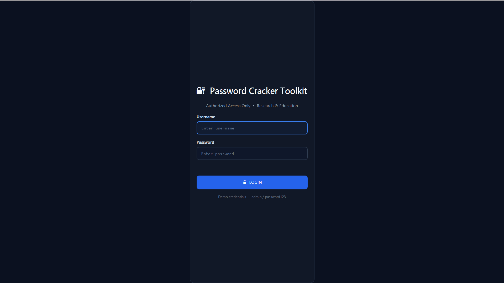
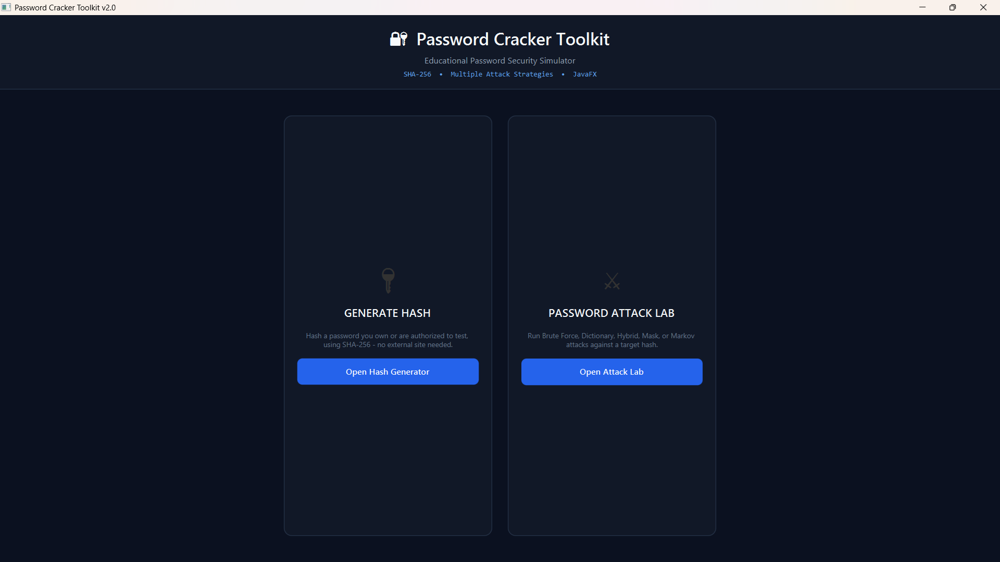
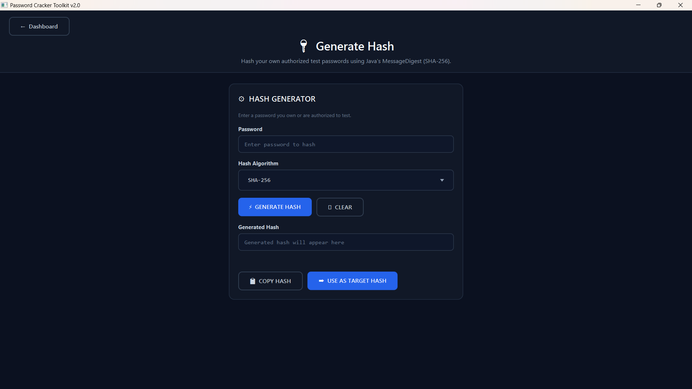
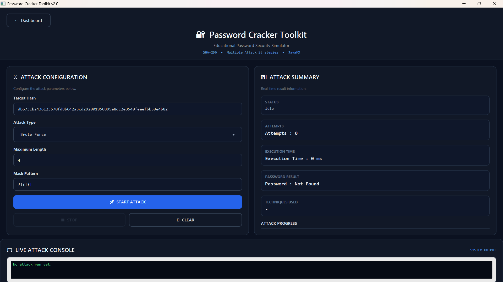
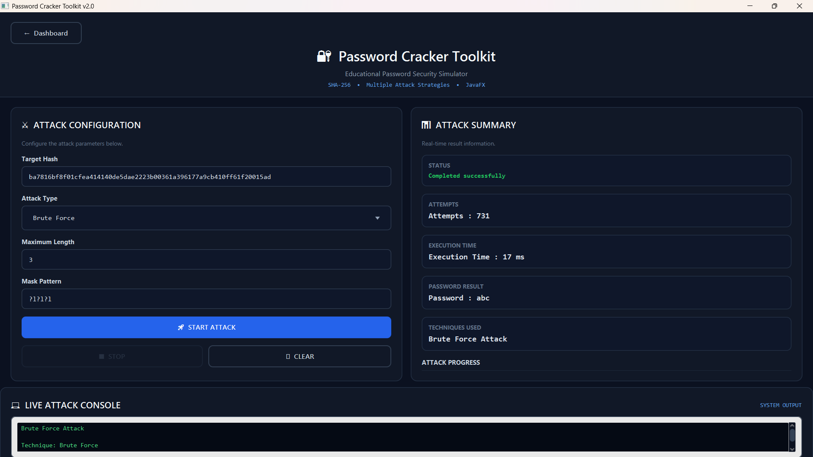
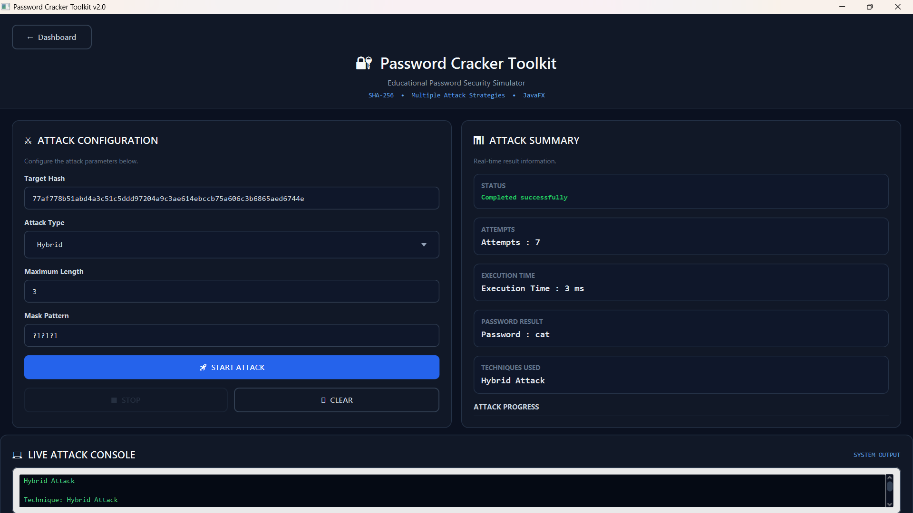
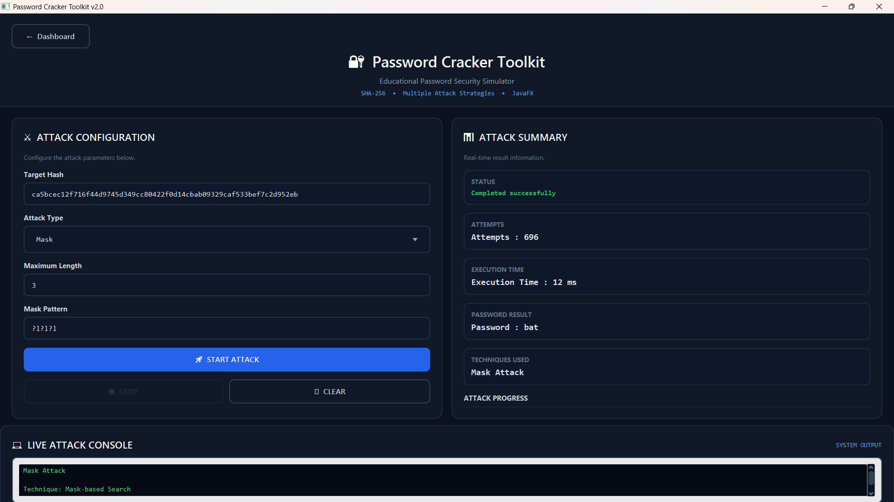

# 🔐 Password Cracker Toolkit

A JavaFX-based desktop toolkit for exploring password hashing and password-cracking algorithms in a controlled, authorized, educational setting. Built as a research/portfolio project to benchmark and demonstrate multiple attack strategies against SHA-256 hashes.

> ⚠️ **Ethical Use Only**
> This toolkit is intended strictly for educational purposes, authorized security research, and testing passwords/hashes that you own or have explicit permission to test. Do not use this tool against systems, accounts, or data you do not own or have authorization to test.

---

## ✨ Features

- **Login-gated access** — the toolkit starts on a login screen before any tool is accessible.
- **Dashboard** with two dedicated modules:
  - 🔑 **Generate Hash** — hash any password internally using SHA-256 via Java's `MessageDigest` API. No external website or API calls involved.
  - ⚔️ **Password Attack Lab** — run cracking algorithms against a target hash.
- **"Use as Target Hash"** — instantly send a generated hash from the Hash Generator into the Attack Lab, or enter a target hash manually.
- **Multiple cracking algorithms**:
  - Brute Force
  - Dictionary Attack
  - Hybrid Attack (Dictionary + Brute Force)
  - Mask Attack (pattern-based search, e.g. `?u?l?l?d?d?d`)
  - Markov Chain-based candidate generation
- **Non-blocking UI** — attacks run on a background thread; the JavaFX UI stays responsive throughout.
- **Real Stop control** — cancels a running attack cooperatively instead of freezing or requiring a force-kill.
- **Input validation** — clear alerts for empty/invalid target hashes, missing algorithm selection, and invalid configuration, instead of silent failures.
- **Cybersecurity/hacker-themed UI** — dark, neon-accented CSS styling throughout.

---

## 📸 Screenshots

| Login | Dashboard |
|-------|-----------|
|  |  |

| Generate Hash | Attack Lab |
|---------------|------------|
|  |  |

---

## 🎯 Attack Results (All Algorithms)

| Brute Force | Dictionary |
|-------------|------------|
|  |  |

| Hybrid | Mask |
|--------|------|
|  |  |

| Markov Chain |
|--------------|
|  |

---

## 🛠️ Tech Stack

| Layer            | Technology            |
|-------------------|------------------------|
| Language           | Java 17                |
| UI Framework       | JavaFX 21 (FXML + CSS) |
| Build Tool         | Maven                  |
| Hashing            | `java.security.MessageDigest` (SHA-256) |

No Spring Boot, no web server, no database — this is a self-contained desktop application.

---

## 📁 Project Structure

```
src/main/java/com/khushi/passwordcracker/
├── PasswordCrackerGUI.java        # App entry point + Attack Lab controller
├── LoginController.java           # Login screen controller
├── MainMenuController.java        # Dashboard controller
├── HashGeneratorController.java   # Generate Hash module controller
├── AppSession.java                # Shared in-memory state (hash handoff)
├── algorithms/
│   ├── BruteForceCracker.java
│   ├── DictionaryAttackCracker.java
│   ├── HybridAttackCracker.java
│   ├── MaskAttackCracker.java
│   └── MarkovChainCracker.java
├── dictionary/
│   └── Wordlist.java
├── model/
│   └── CrackResult.java
└── utils/
    └── HashUtil.java

src/main/resources/
├── login.fxml
├── main-menu.fxml
├── hash-generator.fxml
├── dashboard.fxml                 # Attack Lab screen
└── style.css
```

---

## 🚀 Getting Started

### Prerequisites

- **Java 17** or newer ([Adoptium/Temurin](https://adoptium.net/) recommended)
- **Maven 3.6+**

Check your versions:

```bash
java -version
mvn -version
```

### Clone the repository

```bash
git clone https://github.com/K210605/password-cracker-v2.git
cd password-cracker-v2
```

### Build

```bash
mvn clean compile
```

### Run

```bash
mvn clean javafx:run
```

---

## 🖥️ Usage

1. **Login** — use the demo credentials below (change these in `LoginController.java` for real use):
   - Username: `admin`
   - Password: `password123`
2. **Dashboard** — choose a module:
   - **Generate Hash** — enter a password you're authorized to test, select SHA-256, click **Generate Hash**. Copy it, or click **Use as Target Hash** to send it straight into the Attack Lab.
   - **Password Attack Lab** — enter/paste a target hash, pick an algorithm, set any required parameters (Maximum Length, Mask pattern), and click **Start Attack**.
3. **Monitor** — progress updates live; **Stop** cancels the run cleanly, **Clear** resets the form.
4. **Results** — see whether the candidate password was recovered, along with attempt count and execution time.

---

## 🧠 Algorithms at a Glance

| Algorithm      | Approach                                                                 |
|----------------|---------------------------------------------------------------------------|
| Brute Force    | Exhaustively generates all character combinations up to a max length      |
| Dictionary     | Tests candidates from a curated wordlist                                  |
| Hybrid         | Runs Dictionary first, then falls back to Brute Force                     |
| Mask           | Generates candidates matching a defined character-class pattern           |
| Markov Chain   | Generates likely candidates using character transition probabilities learned from training data |

Attack complexity grows sharply with password length and character-space size — this toolkit is built to make that trade-off tangible and explainable.

---

## 📄 License & Disclaimer

This project is provided for educational and authorized security research purposes only. The author is not responsible for any misuse of this software. Always obtain explicit permission before testing any system, account, or credential that is not your own.
